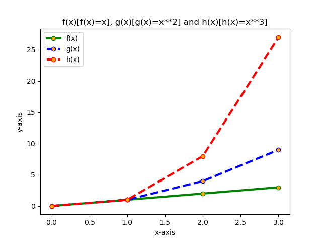

# PandS-Problems
## Keith Brazill - G00387845
### Programming and Scripting tasks 2020

# Introduction
This README explains the code used to solve weekly tasks required as partial fulfillment for the Programming and Scripting module for the postgraduate diploma in Computer Science with Data Analytics. 

# Task 1: 
*Write a program that calculates somebody's Body Mass Index (BMI). The inputs are the person's height in centimetres and weight in kilograms. The output is their weight divided by their height in metres squared.*

**Code:**
```python
weight = float(input("Enter your weight in kg: "))
height = float(input("Enter your height in cm: "))
height_cm_to_m = height/100
BMI = weight / (height_cm_to_m **2)
print('BMI is {:.2f}.'.format(BMI)) 
```
**Explaining the Code:**

Syntax: {[argument_index_or_keyword]:[width][.precision][type]} 


User is prompted to enter height and weight as a float 
(real number i.e. 1.00) number. The users weight is divided
by the height in metres to the power of 2. The output
is printed to the screen. The code "{:.2f}'.format(BMI)" specifies the format of the string. "2f" represents a floating
point number to a precision of 2 decimal places. ".format BMI" 
specifies the output is from the BMI function.

**References:**
1. thepythonguru.com. 2020. Python String Formatting. [online] Available at: <https://thepythonguru.com/python-string-formatting/> [Accessed 29 March 2020].
2. Docs.python.org. 2020. 7.1. String — Common String Operations — Python 2.7.17 Documentation. [online] Available at: <https://docs.python.org/2/library/string.html> [Accessed 29 March 2020]
3. Oreilly.com. 2020. [online] Vanderplas, J., n.d. A Whirlwind Tour Of Python. Available at: <https://www.oreilly.com/programming/free/files/a-whirlwind-tour-of-python.pdf> [Accessed 29 March 2020].
4. Python, B., M, K., Visser, S. and Nath, A., 2020. BMI Calculator In Python. [online] Stack Overflow. Available at: <https://stackoverflow.com/questions/20405610/bmi-calculator-in-python/20405792> [Accessed 29 March 2020].
5. BMI Calculator Ireland. 2020. BMI Calculator - Calculate Your Body Mass Index. [online] Available at: <https://bmicalculatorireland.com/> [Accessed 29 March 2020].

# Task 2:
*Write a program that takes asks a user to input a string and outputs every second letter in reverse order.*

**Code:**
```python
s = input("Please enter a sentence: ")
print(s[::-2])
```
**Explaining the Code:**

The user is prompted to input a string (sentence). The program 
outputs every second letter in reverse order. Example:

* input: The quick brown fox jumps over the lazy dog.
* output: .o zletrv pu o wr cu h

Syntax: stringname[stringlength::-2]
The string name is "s", we do not specify the string length as we want the full lenght we leave as follows [:]. :-2 specifies that we print from the end using only every second letter. In understanding this formula, the code was tested on these lines to understand how these impacted the results and verify the code:
* print(s[:]) - *prints all the string*
* print(s[::-1]) - *prints all the string backwards*

**References:**
1. Oreilly.com. 2020. [online] Vanderplas, J., n.d. A Whirlwind Tour Of Python. Available at: <https://www.oreilly.com/programming/free/files/a-whirlwind-tour-of-python.pdf> [Accessed 29 March 2020].
2. Educative: Interactive Courses for Software Developers. 2020. How Do You Reverse A String In Python?. [online] Available at: <https://www.educative.io/edpresso/how-do-you-reverse-a-string-in-python> [Accessed 29 March 2020].
3. Docs.python.org. 2020. 7.1. String — Common String Operations — Python 2.7.17 Documentation. [online] Available at: <https://docs.python.org/2/library/string.html> [Accessed 29 March 2020].

# Task 3:
*Write a program that asks the user to input any positive integer and outputs the successive values of the following calculation. At each step calculate the next value by taking the current value and, if it is even, divide it by two, but if it is odd, multiply it by three and add one. Have the program end if the current value is one.*

**Code:**

```python
n = int(input("Input positive number: "))    
def collatz(n):                         
    if n % 2 == 0:                          
        return n//2                            
    else:                                     
        return 3*n + 1                         
if n > 0:   	                                
    while n != 1:                               
        print(n)                               
        n = collatz(n)                         
else:                                           
    print("Please enter a positive number!")
```

**Explaining the Code:**
1. First n is defined as an integer.
2. The collatz function is defined as follows, collatz(number is the parameter):
    * if remainder of number divided by 2 is 0 it is even, this
is returned to the function.
    * or else if the number divided by 2 is not = 0
return the result of; 3x number +1 to the function.

3. Next we want to test the collatz function so we begin with trying this code:
    * User is prompted to input a positive integer (n) after running the program.
    * The program first checks if n is greater than 0.
    * While n is not equal to 1 the collatz function keeps running returning the result.
    * The collatz function is applied to n (number inputted)
    * The result of applying the collatz function to n is printed to the screen.
    * The collatz function stops when n = 1

4. If the if the "if" statement fails when a minus number is unput, the else catches this to prevent program crashing.  In this case the following error message is displayed "Please enter a positive number!".

5. Example input and output:
    * Input (n): 10 
    * Output: 10 5 16 8 4 2
    * *Input: -10*
    * *Output: Please enter a positive number!*

**References:**
1. Oreilly.com. 2020. [online] Vanderplas, J., n.d. A Whirlwind Tour Of Python. Available at: <https://www.oreilly.com/programming/free/files/a-whirlwind-tour-of-python.pdf> [Accessed 29 March 2020].
2. Automatetheboringstuff.com. 2020. Automate The Boring Stuff With Python. [online] Available at: <https://automatetheboringstuff.com/chapter3/> [Accessed 29 March 2020].
3. C. and Tanmay, K., 2020. Collatz Sequence. (Python 3). [online] Stack Overflow. Available at: <https://stackoverflow.com/questions/33324432/collatz-sequence-python-3> [Accessed 29 March 2020].
4. Clede, J. and Hallberg, R., 2020. Making A Collatz Program Automate The Boring Stuff. [online] Stack Overflow. Available at: <https://stackoverflow.com/questions/33508034/making-a-collatz-program-automate-the-boring-stuff> [Accessed 29 March 2020].
5. GeeksforGeeks. 2020. Program To Print Collatz Sequence - Geeksforgeeks. [online] Available at: <https://www.geeksforgeeks.org/program-to-print-collatz-sequence/> [Accessed 29 March 2020].

# Task 4:
*Write a program that outputs whether or not today is a weekday.*

**Code:**
```python
import datetime
weekday = datetime.datetime.today().weekday() 
if weekday<5:
    print("Yes, unfortunately today is a weekday.")
else:
    print("It is the weekend, yay!")  
```

**Explaining the Code:**

1. Import datetime, imports the "datetime" module which is in built to python downloaded via Anaconda. This module allows manipulation of dates and times.
2. Next we tell pyhton what a weekday is via the weekday function; weekday = datetime.datetime.today().weekday().
3. Datetime.datetime is a class which has a combination of attributes such as year, month, day, hour, minute, second and microsecond. 
4. We want the output for todays date from the string of weekdays in built to datetime. 
5. The default string is 0:6, 0 being Monday and 6 being Sunday. If we used the print(weekday) command after the weekday function the output would just be a number representing the day of the week, e.g. today is a Sunday the output would be 6.
6. However, we specifically want the output to be string that states whether or not is a weekday or the weekend so we create an if and else statement.
7. If the string is between 0 and <5 (Monday to Friday) the output prints "Yes, unfortunately today is a weekday." or else it prints "It is the weekend, yay!". 

**References:**
1. Oreilly.com. 2020. [online] Vanderplas, J., n.d. A Whirlwind Tour Of Python. Available at: <https://www.oreilly.com/programming/free/files/a-whirlwind-tour-of-python.pdf> [Accessed 29 March 2020].
2. Docs.python.org. 2020. Datetime — Basic Date And Time Types — Python 3.8.2 Documentation. [online] Available at: <https://docs.python.org/3/library/datetime.html> [Accessed 29 March 2020].
3. Pythontic.com. 2020. Weekday Function In Python | Pythontic.Com. [online] Available at: <https://pythontic.com/datetime/date/weekday> [Accessed 29 March 2020].

# Task 5:
*Write a program that takes a positive floating-point number as input and outputs an approximation of its square root. You should create a function called sqrt that does this.*

**Code:**
```python
def newton_method(number, number_iters = 100000):
    a = float(number) 
    for i in range(number_iters): 
        number = 0.5 * (number + a / number) 
    return number
n =  float(input("Enter positve no.: "))
if n < 0:                                      
    print("Please enter a positive number")     
else:
    Sqrt = (newton_method(n))                   
    print(round(Sqrt,1))                      
```

**Explaining the Code:**

1. First the method to calculate the square root is defined. In this case, following online research the Newton Method was deemed as a good solution.
2. We tell the newton method to apply to the inputted number and apply a set numbe of iterations to find the approximate square root,
3. It was found the  number of iterations to run needs to be a large number to get a good approximation. A lower value can result in wrong answer, e.g 1 iteration returns 7.8 as answer for 14.5 which is incorrect. The larger the number the greater the approximation.
4. We then input the newton formula and return result to the sequence. 
5. The user is prompted to input as positive integer after running the program. If this number is less than 0 it does not run, this prevent user to input a negative number as per project brief.
6. If the user inputs a positive number the defined newton method is applied to the number (n) using the Sqrt function and the result is printed to the screen rounded to 1 decimal place. 
7. Example input and output:
    * Input: 14.5
    * Output: 3.8 

**References:**
1. Oreilly.com. 2020. [online] Vanderplas, J., n.d. A Whirlwind Tour Of Python. Available at: <https://www.oreilly.com/programming/free/files/a-whirlwind-tour-of-python.pdf> [Accessed 29 March 2020].
2. L., Logan, R. and zukowski, g., 2020. Limiting Floats To Two Decimal Points. [online] Stack Overflow. Available at: <https://stackoverflow.com/questions/455612/limiting-floats-to-two-decimal-points> [Accessed 29 March 2020].
3. Gist. 2020. Newton_Eng.Py. [online] Available at: <https://gist.github.com/Akaame/0da597d785e2c210cd951b6e7c9e9193> [Accessed 29 March 2020].
4. Medium. 2020. Newton Square Root Method In Python. [online] Available at: <https://medium.com/@sddkal/newton-square-root-method-in-python-270853e9185d> [Accessed 29 March 2020].
5. En.wikipedia.org. 2020. Newton's Method. [online] Available at: <https://en.wikipedia.org/wiki/Newton%27s_method> [Accessed 29 March 2020].

# Task 6:
*Write a program that reads in a text file and outputs the number of e's it contains. The program should take the filename from an argument on the command line.*

**Code:**
```python
txtfile = str(input("Insert Txt File Name: "))
with open (txtfile, "r") as myfile:            
    data = myfile.read()                      
    freq = data.count("e")             
    print(freq)                                 
```

**Explaining the Code:**

1. The user is prompted to enter name of txt file as string.
2. The text file is opened as "myfile" in read (r) mode
3. We define the data function as data = data is equal to the text read in inserted file (myfile.read())
4. We define the freq function which is equal to the count of "e" contained in the inserted file.
4. The frequency (freq) is printed to the screen.
5. A text file "moby-dick.txt is contained within the GitHub repository, the input and output running this program from the command line is contained below:


**References:**
1. Oreilly.com. 2020. [online] Vanderplas, J., n.d. A Whirlwind Tour Of Python. Available at: <https://www.oreilly.com/programming/free/files/a-whirlwind-tour-of-python.pdf> [Accessed 29 March 2020].
2. Docs.python.org. 2020. 7. Input And Output — Python 3.8.2 Documentation. [online] Available at: <https://docs.python.org/3/tutorial/inputoutput.html> [Accessed 29 March 2020].
3. Pythonexamples.org. 2020. How To Count The Number Of Words In Text File? – 2 Python Examples. [online] Available at: <https://pythonexamples.org/python-count-number-of-words-in-text-file/> [Accessed 29 March 2020].
4. Pythonexamples.org. 2020. How To Count Number Of Characters In Text File? – 2 Python Examples. [online] Available at: <https://pythonexamples.org/python-count-number-of-characters-in-text-file/> [Accessed 29 March 2020].
5. Docs.python.org. 2020. Built-In Types — Python 3.8.2 Documentation. [online] Available at: <https://docs.python.org/3/library/stdtypes.html#str.count> [Accessed 29 March 2020].
6. Python, C., Pieters, M. and Smith, A., 2020. Counting Specific Letters Or Symbols In A Text File In Python. [online] Stack Overflow. Available at: <https://stackoverflow.com/questions/22694244/counting-specific-letters-or-symbols-in-a-text-file-in-python> [Accessed 29 March 2020].
7. DataCamp. 2020 [online] Available at: <https://learn.datacamp.com/projects/38> [Accessed 29 March 2020].
8. Python, R., 2020. Reading And Writing Files In Python (Guide) – Real Python. [online] Realpython.com. Available at: <https://realpython.com/read-write-files-python/> [Accessed 29 March 2020].
9. Gutenberg.org. 2020. [online] Available at: <https://www.gutenberg.org/files/2701/old/moby10b.txt> [Accessed 29 March 2020].

# Task 7:
*Write a program that displays a plot of the functions f(x)=x, g(x)=x2 and h(x)=x3 in the range [0, 4] on the one set of axes.*

**Code:**
```python
import numpy as np
import matplotlib.pyplot as plt
x = np.arange(0.0, 4.0, 1.0)
y1 = x      
y2 = x**2   
y3 = x**3   
plt.plot(y1, color='green', linestyle='solid', linewidth = 3, 
         marker='o', markerfacecolor='orange', markersize=6, label='f(x)') 
plt.plot(y2, color='blue', linestyle='dashed', linewidth = 3, 
         marker='o', markerfacecolor='orange', markersize=6, label='g(x)') 
plt.plot(y3, color='red', linestyle='dashed', linewidth = 3, 
         marker='o', markerfacecolor='orange', markersize=6, label='h(x)') 
plt.xlabel('x-axis')
plt.ylabel('y-axis')
plt.title('f(x)[f(x)=x], g(x)[g(x)=x**2] and h(x)[h(x)=x**3]')
plt.legend()
plt.show()                           
```
**Explaining the Code:**

1. First the required libraries were imported:
    * Numpy: Imported as shortcut "np". Numpy is a python scientific computing library which will be used to create a range of the data for this program.
    * Matplot.pyplot: Imported as shortcut "plt". We will use this library to plot the data and visualise the data in a plot e.g., creating a figure, creating a plotting area in the figure, plotting lines in the plotting area, decorating the plot with labels, etc.
2. Next we define the value of x and create a range for the x-axis using numpy.arange. The brief is to use a range [0,4]. 1.0 is used as the step ((np.arange(0.0, 4.0, 1.0))
3. The y-axis values are defined by stating the values for y1(x), y2(x2) and y3(x3). 
4. Now that the x-axis and y-values are defined the points for f(x), g(x) and h(x) can be plotted using the plt.plot command.
5. For each point on the plot it is formatted by the line colour, linetype, linewidth, the marker on the line at point, colour of marker and marker size for each of above points (y1,y2 and y3), the label adds the name of the line.
6. N.B the  plt.legend() command is required to show the labels on the plot. 
7. Next the x axis is labelled (plt.xlabel('x-axis')) and y-axis is labelled (lt.ylabel('y-axis'))
8. The plot is then given a title, for clarity it was decided to display the functions for x as the title of the graph.
9. Finally the graph is ready to be graphically represented, plt.show() depicts a graphic representation of the plot.



**References:**
1. Oreilly.com. 2020. [online] Vanderplas, J., n.d. A Whirlwind Tour Of Python. Available at: <https://www.oreilly.com/programming/free/files/a-whirlwind-tour-of-python.pdf> [Accessed 29 March 2020].
2. J. D. Hunter, "Matplotlib: A 2D Graphics Environment", Computing in Science & Engineering, vol. 9, no. 3, pp. 90-95, 2007.
3. GeeksforGeeks. 2020. Graph Plotting In Python | Set 1 - Geeksforgeeks. [online] Available at: <https://www.geeksforgeeks.org/graph-plotting-in-python-set-1/> [Accessed 29 March 2020].
3. Python, R., 2020. Python Plotting With Matplotlib (Guide) – Real Python. [online] Realpython.com. Available at: <https://realpython.com/python-matplotlib-guide/> [Accessed 29 March 2020].
4. Gambling, S., 2020. How To Label A Line In Matplotlib (Python)?. [online] Stack Overflow. Available at: <https://stackoverflow.com/questions/17941083/how-to-label-a-line-in-matplotlib-python/17942066> [Accessed 29 March 2020].
5. Projects.datacamp.com. 2020. Projects. [online] Available at: <https://projects.datacamp.com/projects/33> [Accessed 29 March 2020].
6. Cs231n.github.io. 2020. Python Numpy Tutorial. [online] Available at: <http://cs231n.github.io/python-numpy-tutorial/> [Accessed 29 March 2020].
7. Matplotlib.org. 2020. Pyplot Tutorial — Matplotlib 3.2.1 Documentation. [online] Available at: <https://matplotlib.org/tutorials/introductory/pyplot.html> [Accessed 29 March 2020].

# End